# SUScan - Getting Started Guide
SUScan is a graphical signal analysis tool compatible with a variety of signal sources, including some popular SDR devices, GQRX captures and even the soundcard.  It features a switchable real-time spectrum / waterfall view, a blind channel detector and a [PSK](https://en.wikipedia.org/wiki/Phase-shift_keying) channel inspector. QAM, OFDM and DSSS support is also planned.

Due to the current experimental status of SUScan, this document will be a brief summary of its most common use case: reverse-engineer [PSK](https://en.wikipedia.org/wiki/Phase-shift_keying) channels by discovering its modulation parameters.

## The main interface
This is what you should see after executing SUScan:

 

For PSK analysis, we must take into account the following elements:

* **Preferences button**: In the upper-left corner of the window, with a gear-shaped icon. This button opens the source selection dialog and lets you configure the current signal source. Other global settings (most of them related to the channel detector) can also be configured from here.
* **Run/stop button**: Starts / stops a signal capture from the current signal source.
* **Spectrum view**: Frequency domain representation of the signal being analyzed. Supports two modes: spectrogram (default) and waterfall.
* **Spectrum view mode switch**:  By clicking on the button with the tool-shaped icon in the right you can switch between spectrogram and waterfall mode. 
* **Channel overlay button**: Right below the spectrum/waterfall switch button, this button toggles the display of discovered channels on top of the spectrum view.
* **Automatic level adjustment button**: Located after the channel overlay button, it toggles automatic level adjustment. If enabled, the spectrum is automatically rescaled to fit in the spectrum view.
* **Channel list**: Located below the spectrum view. When a signal capture is running, it is filled with all the potential channels found by the channel detector.

## Configuring a signal source
The first step to reverse-engineer a [PSK](https://en.wikipedia.org/wiki/Phase-shift_keying) signal is to tell SUScan how signal data is acquired. This is done by clicking on the preferences button:

 

The topmost drop-down list lets you choose the signal source type. SUScan currently supports the following source types:

* **Silent source**: Dummy null device, it produces a sequence of zeroes.
* **WAV File**: Useful when you record a narrow-band radio signal directly from your soundcard. This is what I usually do with HF signals received by my [Sangean ATS 909](http://www.sangean.eu/products/discontinued/ats-909-w.html) that fit in the audible spectrum.
* **GQRX I/Q recording**: If you are a [Gqrx](http://gqrx.dk/) user, you can use its signal capture files as signal source.
* **BladeRF**: Perform live capture from [Nuand's BladeRF SDR](https://nuand.com/) . If you have an [XB-300](https://www.nuand.com/blog/product/amplifier/)  amplifier, you can configure it from here.
* **HackRF**: Perform live capture from [Great Scott Gadget's HackRF](https://greatscottgadgets.com/hackrf/) .
* **ALSA live capture**: Capture samples directly from the soundcard. If you happen to use pulseaudio, you can plug the sound output of another program (like your browser) to SUScan's audio input. This is particularly useful if you are a user of WebSDR services like [UTwente's](http://websdr.ewi.utwente.nl:8901/).

The configuration options vary a lot depending on the source type, but you will usually find the following ones in most of them:

* **Sampling frequency**: Set the sample rate. For live sources, this defines the number of data samples per second delivered to SUScan. For pre-recorded sources, it used to compute frequencies and baudrates correctly and configure throttling. 
* **Center frequency**: For live sources, it corresponds to the tuner frequency in Hz. It is optional for pre-recorded sources as it simply allows you to configure the central frequency in the spectrum.
* **Loop**: For pre-recorded sources, it tells SUScan to keep reading samples from the beginning after reaching the end of file.

## Starting a signal capture and selecting a channel
Click on the Run/Stop button on the top-left corner of the window. If your source was properly configured, you should see a spectrum plot in the spectrum view and (hopefully) a channel list:

 

The red rectangles overlaid on the spectrum plot represent the parameters of the detected channels. If you zoom horizontally (using the mouse wheel) and center any channel (dragging with the primary mouse button), you will see that the corresponding rectangle is formed by two nested rectangles. The innermost rectangle represents the channel bandwidth as the integral of its PSD divided by its peak PSD, while the outermost one represents the difference between its highest and lowest frequencies. The channel center is always computed using the [autocorrelation technique](https://en.wikipedia.org/wiki/Autocorrelation_technique):

 

Please note that automatic channel detection is a purely heuristic feature based on continuous estimations of the squelch level and, because of its nature, it could fail (especially when there are lots of channels along the spectrum). In that case, you can manually define a channel by pressing shift while dragging over the frequency span of the channel. You should see a cyan rectangle as you define the new channel limits:

 

After finding / defining the channel of interest, you are ready to start the actual channel analysis by right-clicking on it and choosing "Open PSK inspector":

 

## The channel inspector tab
After opening the PSK inspector over the desired channel, you should see something like this:

This is the inspector tab. It allows you analyze, detect and configure a set of modulation parameters in a PSK signal. It is basically a configurable generic [PSK](https://en.wikipedia.org/wiki/Phase-shift_keying) demodulator. From left to right, top-down, it features:

* **Constellation plot**: Scatter plot representing the amplitude and phase of the sampler output.
* **Transition plot**: Symbol transition representation, either as a transition matrix or a transition graph. You can switch from one to another just by left-clicking on it.
* **Spectrum plot**: Power spectrum and cyclostationary spectrum analysis of the desired channel, disabled by default.
* **Demodulator properties**: Set of controls to define the channel modulation parameters. It also features a couple of automatic baudrate detectors.
* **Symbol recorder**: After properly configuring the demodulator parameters, it allows you to record, save and process demodulated symbols. 

Even though you can set a bunch of modulation parameters for the channel, for every channel you must define at least two: the **baudrate** and the **constellation type**. **If one of these two is missing, the demodulator will not know when to sample the received signal or how to track the carrier frequency in order to retrieve the variations of the signal phase, and you will not be able to demodulate anything.**

## Step 1: finding the baudrate of the signal
SUScan provides three ways to detect the baudrate of the signal:
* **Cyclostationary analysis + autocorrelation technique**: Also known as non-linear baudrate detection ([paper here](https://www.iasj.net/iasj?func=fulltext&aId=51991)). This method usually produces the best estimate. However, if there is not enough significate, it will fail. You can perform this detection by clicking on "Detect baudrate (cyclo)" under the "Clock control" (right side of the window).
* **Fast autocorrelation**: It computes an averaged autocorrelation function of the channel signal and returns the inverse of the delay of the first local minimum. The intuition behind this method is the following: if the symbol probability distribution is flat enough (which is usually true, as PSK signals are usually scrambler), the signal will not be correlated at all with itself delayed one symbol. However, this method provides a rough estimate as it depends on the number of coefficients of the autocorrelation function buffer. You can perform this detection by clocking on "Detect baudrate (FAC)"
* **Manual inspection**: If both methods fail, you can click on "Cyclostationary analysis" under "Spectrum source". This will display the frequency spectrum of the function `|x(n) - x(n-1)|`, used by the non-linear baudrate detection. You may use this function to detect peaks that are consistent with a baudrate.

In any case, you can always set the baudrate manually by typing it on the baudrate text box and clicking on "Set baudrate".

The typical procedure to find the baudrate of the signal is like this:
1. Click on "Detect baudrate (cyclo)" several times. If the baudrate text box stabilizes to a value that looks valid (1200, 2400, 8000... typical baudrates found out there are usually multiples of 100), you are done. If not (or if the baudrate is zero) move to the next step.

2. Click on "Detect baudrate (FAC)" several times. Again, if it stabilizes to something that looks like a baudrate, you are done. If not, move to the next step. Have in mind however that since this estimate is usually rather inaccurate, you may need to correct it in the baudrate box. It is usually a good idea to compare this result to the cyclostationary spectrum.

3. If both methods above have failed, the only chance you have to find the right baudrate is by manual inspection. Select "cyclostationary analysis" in the spectrum source frame and look for the rightmost (or leftmost) peak in the spectrum plot. For instance, this is what the cyclostationary spectrum of a 1200 baud QPSK signal looks like. Notice the peaks in +/-1200 baud surrounding the DC signal:

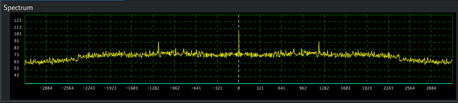

As in the spectrum plot of the main window, you can zoom and re-center the spectrum using your mouse.

If you succeed at finding the baudrate, you can click on "Set baudrate". This enables the sampler and you should see a cloud of points in the constellation plot:

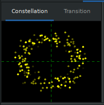

Now, click on "Automatic clock recovery (Gardner's method)". This will use the [Gardner algorithm](http://read.pudn.com/downloads163/ebook/741040/Gardner_algorithm.pdf) to recover the symbol timing in real-time. You should not be able to see a big difference here, because the signal carrier is still not recovered and there is a frequency component in the received samples that makes the whole constellation spin around its center. This is something we will fix in the next step.

## Step 2: Recovering the carrier
PSK signals lack a constant carrier signal that you can track using a regular PLL. Instead, the carrier phase changes smoothly but faster than the symbol period, making automatic frequency control (necessary to stabilize the constellation) slightly more difficult. The appropriate mechanism to recover a stable phase reference from a signal whose phase is constantly switching between a set of pre-defined values is a [Costas loop](https://en.wikipedia.org/wiki/Costas_loop). 

Costas loop implementations are particularized to a given number of equally-spaced phases (i.e. PSK modulation order). SUScan features order 2, 4 and 8 Costas loops, with which you can track the carrier of **BPSK**, **QPSK** and **OPSK** signals respectively. There are other PSK variants, but their number of phases usually fall in one of the tree aforementioned categories (e.g. π/4-QPSK consists of two overimposed QPSK constellations separated by 45º, effectively behaving as OPSK with constraints in the set of allowed phase transitions)

There is no way to get estimates of the modulation order (*yet*). It is not a technical challenge either and it is planned for future releases. Currently, the only way to find the constellation type is by manually testing all three of them. If you are lucky, the point cloud will now form clusters around the symbol phases: you are *in lock*. For instance, if you had a QPSK signal, you should see something like this:

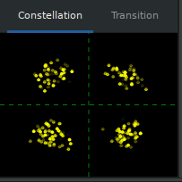

The size of the clusters is related to the signal noise: the bigger they are, the noisier your signal is. If the noise power is too strong, the PSK demodulator may even fail to lock. Fortunately, SUScan implements mechanisms to improve the SNR. This is covered in the next step.

## Step 3: Enhancing the signal
SUScan provides two features that may help improve the SNR of your signal: matched filtering and blind equalization.

Many PSK modulators use the [square root raised cosine filter (SRRC)](https://en.wikipedia.org/wiki/Root-raised-cosine_filter) to reduce inter-symbol interference and improve SNR in the receiver side. This, however, is not guaranteed. If you click on "Root raised cosine" (located under "Matched filter") and the transmitter is using it too, the noise of your constellation could be reduced to this:

If you listen to HF or terrestrial stations, you will probaby face the problem of multipath distortions caused by reflections on mountains and buildings, refractions, etc. This impacts heavily on the quality of your constellation. An extreme case of multipath distortion can make your constellation look like this:

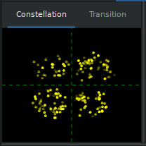

The remedy for this scenario is to perform blind equalization on the signal. Using the "Constant Modulus Algorithm (CMA)" (located in "Equalizer"), SUScan will use its knowledge of PSK modulations (i.e. ideally, PSK signals have constant amplitude) to compute a filter that undoes the distortion produced by the channel. It usually takes a while for the CMA to find this filter but, once it finds it, your constellation can be enhanced to this:

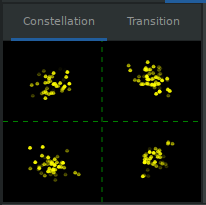

Note: If you are dealing with satellite signals, you will not notice any effect. In fact, it can make things even worse! If you still fail to lock, your best options here are to increase the Roll-off factor of the matched filter and reduce Gardner algorithm's loop gain.

## Step 3½: Tips for telling PSK variations apart
As previously mentioned, there are many PSK variations that share the same constellation type but differ on the set of phase transitions they allow. After stabilizing your constellation, pen the "Transition" tab, and click in its display area. For regular QPSK you should see something like this:

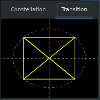

Every symbol transition is displayed as a line communicating both symbols involved. The thicker is the line, the more frequent is the transition. In this case, as all transitions are allowed, all phases are connected.

For OQPSK things are different: 180º transitions are forbidden. The only way to change the phase in 180º is by transmitting two symbols 90º apart in the same sense. The resulting graph lacks the diagonal lines that represent 180º transitions:

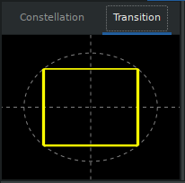

Something similar happens with OPSK and π/4-QPSK. In regular OPSK all 8x8=16 transitions are allowed:

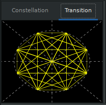

However, in π/4-QPSK, each symbol must change to a subset of 4 equally spaced phases that are at least 45º apart from the current phase. The resulting transition graph lacks most of regular OPSK transitions:

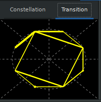

For high order modulations (i.e. QPSK and OPSK) you will need this information to figure out how much information is carried by each symbol. For instance, in regular OPSK, every symbol carries up to 3 bits of information while π/4-QPSK cannot carry more than 2.

**Important notes on π/4-DQPSK / QPSK**: in π/4-DQPSK constellations, is rather common to find long sequences of small transitions in the same phase direction (related to long sequences of the same symbol). From the perspective of an order-4 Costas Loop, this looks like the carrier is off by π/4 per symbol. **Even though this looks like a misdetection, it is not:** as the phase shift is always the same, you can either see it as a constant offset from the true QPSK carrier frequency or as a property of the 8-PSK symbol sequence. 

It is rather difficult to tell these two constellations apart because we lack a multiply-filter-divide spectrum (this is, computing the FFT after taking the *n*-th power of the signal). This should be available as a new spectrum source soon. In the mean time, if the constellation order is uncertain, you should compare it against the output of the order-8 Costas Loop with a small loop gain (-34 dB should do) and check the symbol transitions. If the order-8 Costas Loop is able to sync to a constellation with 8 phases (and not only 4), you are probably dealing with a π/4-DQPSK signal.

Here is an example of a π/4-DQPSK constellation with SRRC filter (roll-of: 1.0) as synchronized by the order-8 Costas Loop:

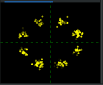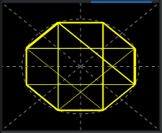

And this is how it looks like as synchronized by the order-4 Costas Loop:
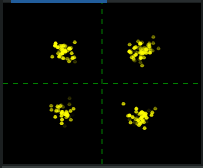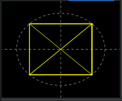

The equivalence shows up in the symbol view. Let's take for instance the following π/4-DQPSK symbol sequence:

`2222000000000000000000000000000000002222203011201210313110300210223300200132220232103`

If you choose the order-8 Costas Loop, you would see the following:

`7416701234567012345670123456701234563052707036347470721470701612743234123652745216121`

but if you choose the order-4 Costas Loop, you would get this:

`2020222222222222222222222222222222222020200330133023323230033312202100022232020021300`

## Step 4: Recording symbols
Click on the "Symbol recorder" tab. You should see something like this:

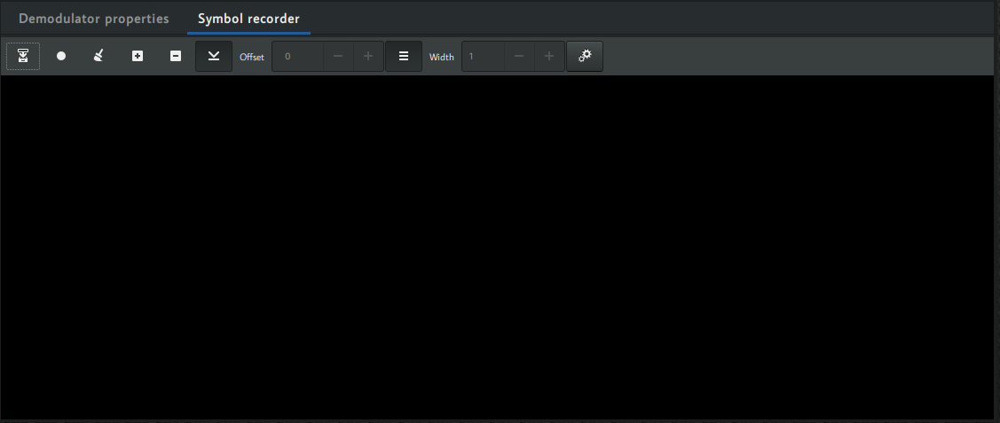

This tool allows you to visualize symbols at the demodulator output as a sequence of pixels, displayed in the symbol view (the black area of the tab). The lighter is the pixel, the higher is the symbol phase. For BPSK signals, black pixels represent symbol phase 0 and white pixels symbol phase 180º (you usually interpret this as bits). For QPSK signals, there are 4 shades of gray for symbol phases 0º, 90º, 180º and 270º. For OPSK there are 8 shades of gray, etc.

Please note that since symbol representation is tied to the current Costas loop selection, you will not be able to record symbols if the carrier control is set to manual. This should change in the future, though.

The toolbar on top allows you to control the recording process and representation. From left to right:
* **Save**: save the current symbol view as a text file. Every symbol is saved as a digit from `0` to `n-1`, with `n` being the constellation order.
* **Record/pause**: start or stop recording symbols. 
* **Clear buffer**: delete all recorded symbols in the symbol view.
* **Zoom in (+) and out (-)**: increase or decrease pixel size.
* **Autoscroll**: move to the bottom of the view after a new symbol row is added.
* **Offset**: set the first symbol displayed in the symbol view. Enabled if autoscroll is disabled.
* **Fit width**: autofit the symbol view row width to the window width. New symbols that fall beyond the window border will be displayed in the beginning of the next row.
* **Width**: manually set the symbol row width.

Let's assume you are demodulating a BPSK signal. Click on "Record" and see how the symbol view gets filled as new symbols are demodulated:

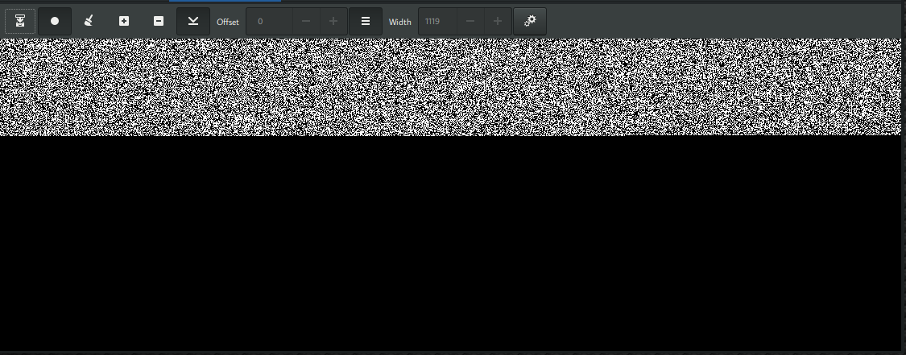

This is already a stream of zeroes and ones that you can save for further processing with other applications. Normally, this is where your work with SUScan ends. However, depending on the regularity of your data, you can extract some properties of the symbol stream.

Let's say that instead of the static-like pattern in the picture above you see something like this (some parts were blurried on purpose):

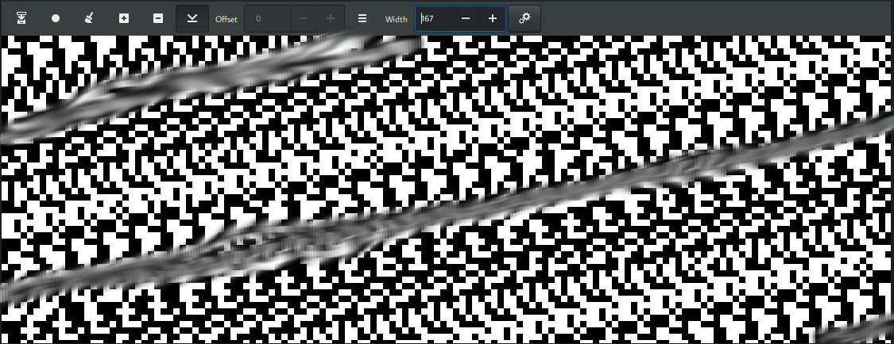

Diagonals in the symbol view suggest that there is some repeating structure, usually related to a fixed frame size. If you right-click on the symbol view and click on "FAC Analysis", you should get the two most probable frame sizes. You get two because of the ambiguity of the autocorrelation: since the autocorrelation buffer is limited to 8192, a repeating frame of `n` samples long will produce the same autocorrelation peaks as a repeating frame of `8192-n` samples long.

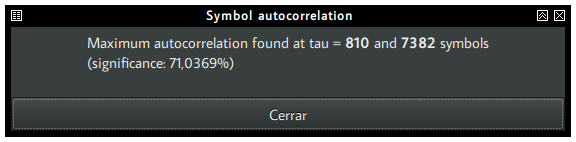

Most of the time, the right size is the smallest number (810). After disabling "Fit width" and typing this quantity in the "Width" text box, you may see something like this:

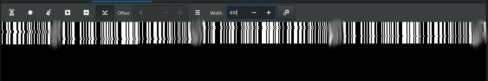

As repeating structures are fitting the row width, you are basically stacking them one on top of the other. Sometimes, the FAC analysis gives you a multiple of the actual frame size (in this case, the actual size was 162). You apply FAC on a subset of the recorded symbols by previously selecting them, and try to get a smaller number:

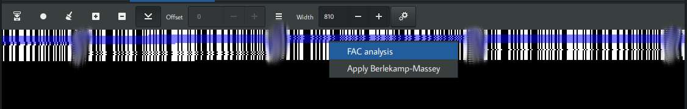

**The following step works with BPSK signals only**: In BPSK signals, the symbol sequence is usually passed through a scrambler implemented as an [LFSR](https://en.wikipedia.org/wiki/Linear-feedback_shift_register). Repeating barcode-shaped patterns like the ones in the picture are usually a sign of that. Now select these repeating bits (not the whole frame!), right-click on the symbol view and select "Apply Berlekamp-Massey". You should see a message box like this:

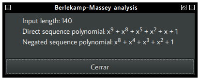

This tells you the feedback polynomial coefficients of the underlying LFSR. Since there is an ambiguity on how symbol phases are converted to bits (0º can represent 0 or 1, while 180º can represent 1 or 0), Berlekamp-Massey analysis gives you two polynomials for both options.

In general, if the polynomial degree is much smaller than the input length (9 << 140 in this case), you can be rather certain that you found the right coefficients. However, if the degree of the polynomial is around the half of the input length, the sequence is probably not generated by an LFSR.

