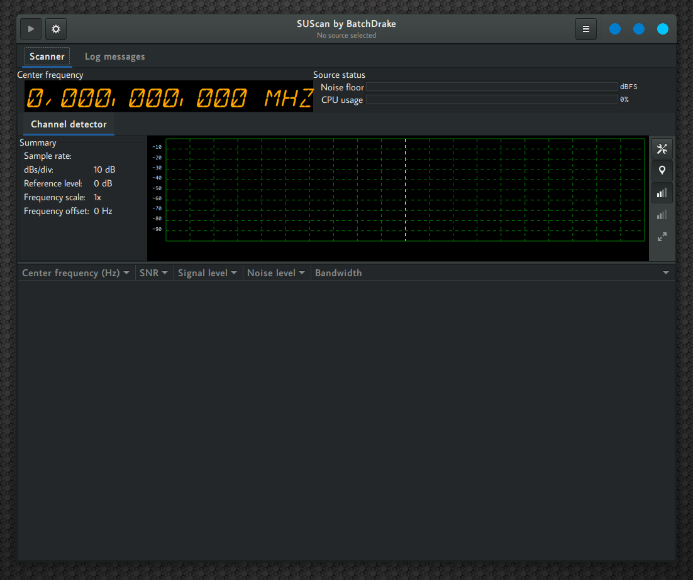
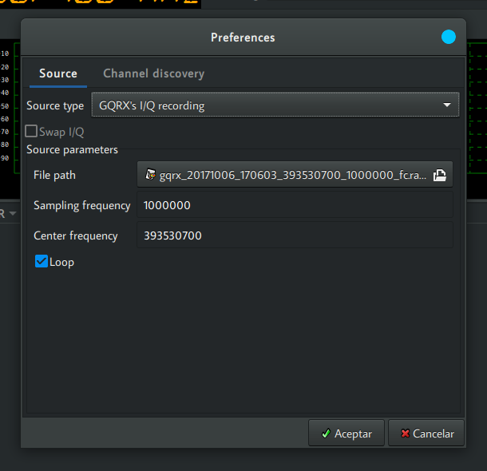
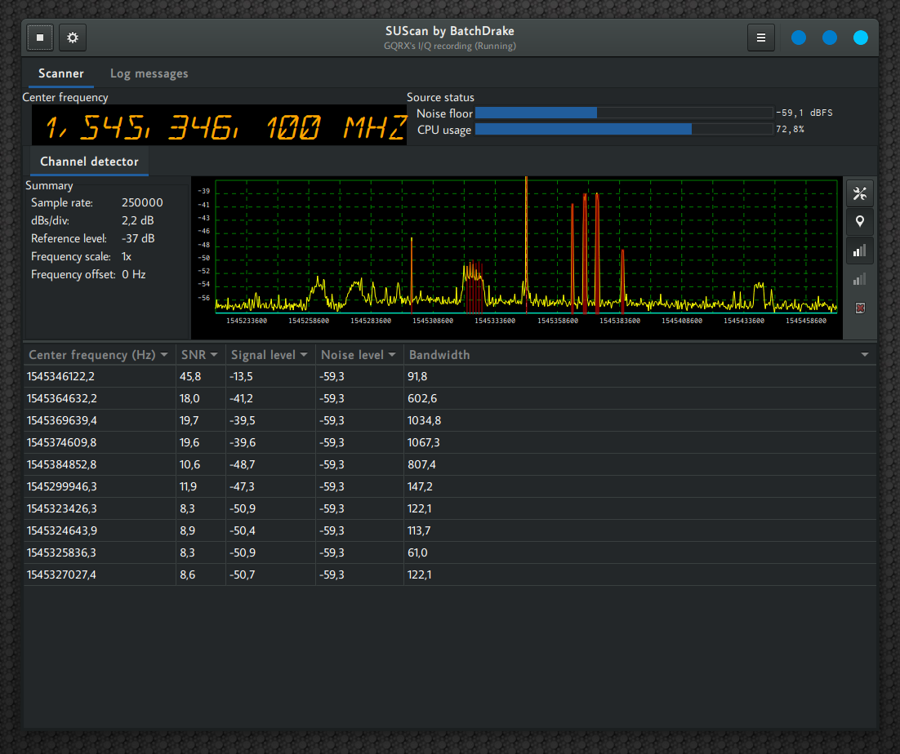
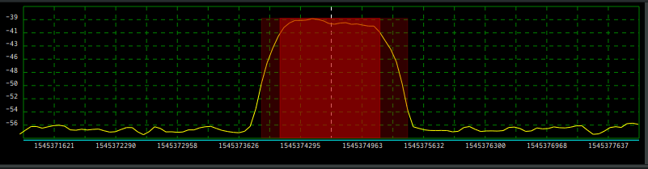
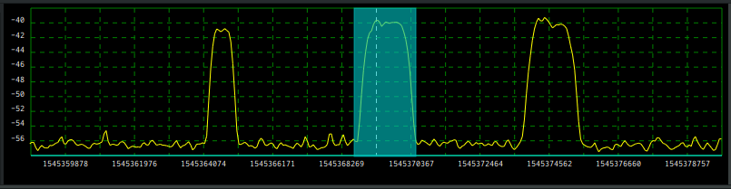
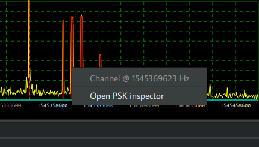
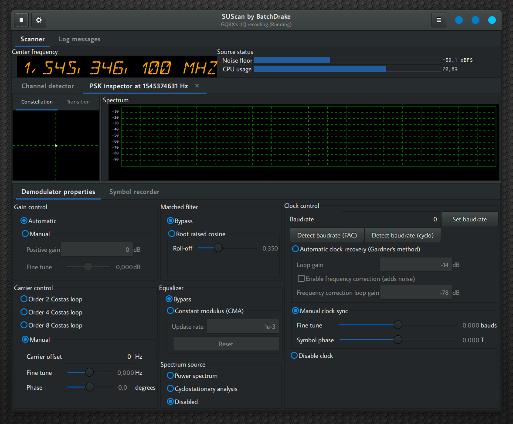

# SUScan - Getting Started Guide
SUScan is a graphical signal analysis tool compatible with a variety of signal sources, including some popular SDR devices, GQRX captures and even the soundcard.  It features a switchable real-time spectrum / waterfall view, a blind channel detector and a PSK channel inspector. QAM, OFDM and DSSS support is also planned.

Due to the current experimental status of SUScan, this document will be a brief summary of its most common use case: reverse-engineer PSK channels by discovering its modulation parameters.

## The main interface
This is what you should see after executing SUScan:

 

For PSK analysis, we must take into account the following elements:

* **Preferences button**: In the upper-left corner of the window, with a gear-shaped icon. This button opens the source selection dialog and lets you configure the current signal source. Other global settings (most of them related to the channel detector) can also be configured from here.
* **Run/stop button**: Starts / stops a signal capture from the current signal source.
* **Spectrum view**: Frequency domain representation of the signal being analyzed. Supports two modes: spectrogram (default) and waterfall.
* **Spectrum view mode switch**:  By clicking on the button with the tool-shaped icon in the right you can switch between spectrogram and waterfall mode. 
* **Channel overlay button**: Right below the spectrum/waterfall switch button, this button toggles the display of discovered channels on top of the spectrum view.
* **Automatic level adjustment button**: Located after the channel overlay button, it toggles automatic level adjustment. If enabled, the spectrum is automatically rescaled to fit in the spectrum view.
* **Channel list**: Located below the spectrum view. When a signal capture is running, it is filled with all the potential channels found by the channel detector.

## Configuring a signal source
The first step to reverse-engineer a PSK signal is to tell SUScan how signal data is acquired. This is done by clicking on the preferences button:

 

The topmost drop-down list lets you choose the signal source type. SUScan currently supports the following source types:

* **Silent source**: Dummy null device, it produces a sequence of zeroes.
* **WAV File**: Useful when you record a narrow-band radio signal directly from your soundcard. This is what I usually do with HF signals received by my [Sangean ATS 909](http://www.sangean.eu/products/discontinued/ats-909-w.html) that fit in the audible spectrum.
* **GQRX I/Q recording**: If you are a [Gqrx](http://gqrx.dk/) user, you can use its signal capture files as signal source.
* **BladeRF**: Perform live capture from [Nuand's BladeRF SDR](https://nuand.com/) . If you have an [XB-300](https://www.nuand.com/blog/product/amplifier/)  amplifier, you can configure it from here.
* **HackRF**: Perform live capture from [Great Scott Gadget's HackRF](https://greatscottgadgets.com/hackrf/) .
* **ALSA live capture**: Capture samples directly from the soundcard. If you happen to use pulseaudio, you can plug the sound output of another program (like your browser) to SUScan's audio input. This is particularly useful if you are a user of WebSDR services like [UTwente's](http://websdr.ewi.utwente.nl:8901/).

The configuration options vary a lot depending on the source type, but you will usually find the following ones in most of them:

* **Sampling frequency**: Set the sample rate. For live sources, this defines the number of data samples per second delivered to SUScan. For pre-recorded sources, it used to compute frequencies and baudrates correctly and configure throttling. 
* **Center frequency**: For live sources, it corresponds to the tuner frequency in Hz. It is optional for pre-recorded sources as it simply allows you to configure the central frequency in the spectrum.
* **Loop**: For pre-recorded sources, it tells SUScan to keep reading samples from the beginning after reaching the end of file.

## Starting a signal capture and selecting a channel
Click on the Run/Stop button on the top-left corner of the window. If your source was properly configured, you should see a spectrum plot in the spectrum view and (hopefully) a channel list:

 

The red rectangles overlaid on the spectrum plot represent the parameters of the detected channels. If you zoom horizontally (using the mouse wheel) and center any channel (dragging with the primary mouse button), you will see that the corresponding rectangle is formed by two nested rectangles. The innermost rectangle represents the channel bandwidth as the integral of its PSD divided by its peak PSD, while the outermost one represents the difference between its highest and lowest frequencies. The channel center is always computed using the [autocorrelation technique](https://en.wikipedia.org/wiki/Autocorrelation_technique):

 

Please note that automatic channel detection is a purely heuristic feature based continuous estimations of the sequelch level and, because of its nature, it could fail (especially when there are lots of channels along the spectrum). In that case, you can manually define a channel by pressing shift while dragging over the frequency span of the channel. You should see a cyan rectangle as you define the new channel limits:

 

After finding / defining the channel of interest, you are ready start the actual channel analysis by right-clicking on it and choosing "Open PSK inspector":

 

## The channel inspector tab
After opening the PSK inspector over the desired channel, you should see something like this:

This is the inspector tab. It allows you analyze, detect and configure a set of modulation parameters in a PSK signals. It is basically a configurable generic PSK demodulator. From left to right, top-down, it features:

* **Constellation plot**: Scatter plot representing the amplitude and phase of the sampler output.
* **Transition plot**: Symbol transition representation, either as a transition matrix or a transition graph. You can switch from one to another just by left-clicking on it.
* **Spectrum plot**: Power spectrum and cyclostationary spectrum analysis of the desired channel, disabled by default.
* **Demodulator properties**: Set of controls to define the channel modulation parameters. It also features a couple of automatic baudrate detectors.
* **Symbol recorder**: After configuring the demodulator properly, it allows you to record, save and process demodulated symbols. 

